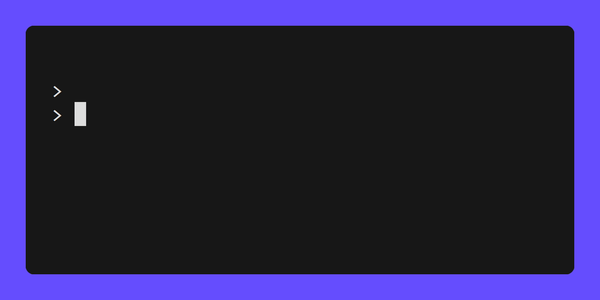
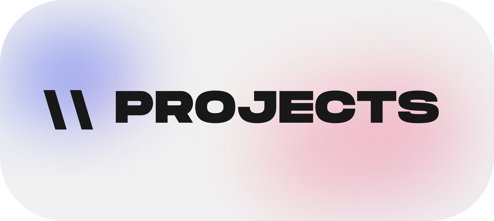
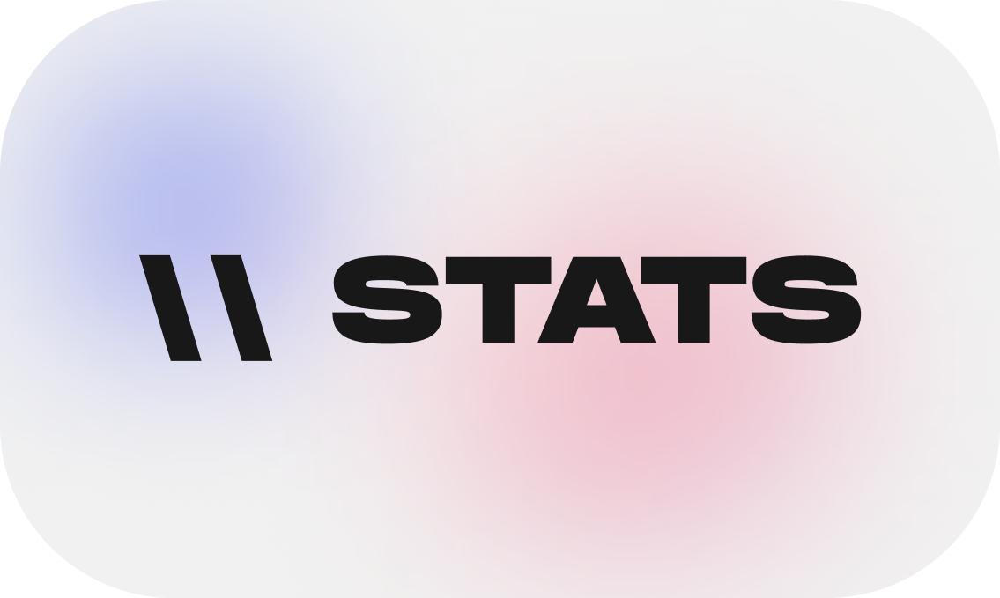

 
 

 

| Project                 |                                                                     Description                                                                     |                                                                 Link |
| ----------------------- | :-------------------------------------------------------------------------------------------------------------------------------------------------: | -------------------------------------------------------------------: |
| Portfolio website       |              A website that showcases my projects, skills for the world to see with `html`, `css`, `bootstrap`, `animejs` & `alpinejs`              |       [link](https://github.com/realanupreet/realanupreet.github.io) |
| TwitterClone            |                                              Twitter UI clone made with `jetpack compose` and `kotlin`                                              |                 [link](https://github.com/realanupreet/TwitterClone) |
| BurgerHat               |                                            A storefront powered by `medusa js`, `next js` and `tailwind`                                            |                    [link](https://github.com/realanupreet/burgerHat) |
| Mask detector           | A happy website built with `html`, `css` and `js` for happy people to see if their happy faces are wearing a mask or not. `Transfer learning` based |                 [link](https://github.com/realanupreet/maskDetector) |
| Delicious Notes App     |              A nice and simple note taking website with `html`, `css` and `js` that makes use of local storage for storing your notes.              |               [link](https://github.com/realanupreet/deliciousNotes) |
| Naice Movies            |                                 Web app built using `Django` that allows users to browse and watch movie trailers.                                  |                 [link](https://github.com/realanupreet/naice-movies) |
| Bootstrap               |                                     A simple website i developed to play with `bootstrap 5` and its components                                      |                       [link](https://github.com/realanupreet/bs5fun) |
| Super-og-react todo app |                                  A simple note taking app with `react`, uses animation for notes entering and exit                                  | [link](https://github.com/realanupreet/super-og-react-todo-list-app) |

 
 

 
 

 

<!-- &ensp;  -->

 

  <!---
  realanupreet/realanupreet is a ✨ special ✨ repository because its `README.md` (this file) appears on your GitHub profile.
  You can click the Preview link to take a look at your changes.
  --->

